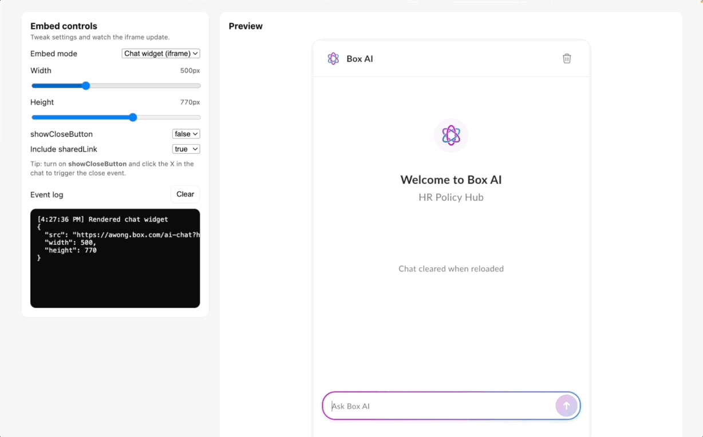

# Box Hubs AI Chat — Embed Demo

This repository shows how to embed **Box Hubs AI Chat** into a web page using the embed code generated by Box.

Box Hubs AI Chat can be embedded either as:
- an iframe widget, or
- a script-based chat button

This demo includes a small amount of client-side code to make it easy to explore how those embeds behave when resized, toggled, or configured with different options.

---

## Embedding Box Hubs AI Chat (documentation)

Guidance for embedding Box Hubs AI Chat lives in the Box developer documentation:

**Box Hubs AI Chat embedding guide**  
https://developer.box.com/guides/embed/box-embed#box-hubs-ai-chat-embedding

The Box UI generates the embed code for both widget and chat button modes. That generated code is what should be used in real applications.

---

## What’s in this repo

- **index.html**  
  A minimal page that hosts the embed.

- **app.js**  
  Lightweight JavaScript that:
  - builds an iframe `src`
  - switches between widget and chat button modes
  - adjusts size and behavior for demonstration purposes
  - listens for the optional close event

- **styles.css**  
  Minimal styling to keep the embed centered and readable.

All Box-specific values (Hub ID, shared link, domain, script URL) are defined as placeholders at the top of `app.js`.

---

## Getting started

1. Clone or download this repository.
2. Open `app.js`.
3. Replace the placeholder values at the top of the file with values copied from the **Box UI embed code**:
   - Hub ID
   - Shared link (if applicable)
   - Box domain
   - Chat button script URL (if using chat button mode)
4. Open `index.html` locally or deploy it via GitHub Pages.

---

## Using the embed code directly

The Box UI–generated embed code can be pasted directly into a web page.

The additional JavaScript in this repo exists to:
- demonstrate how embed parameters affect behavior
- show optional resizing and mode switching
- illustrate how the close button event can be handled

None of that logic is required to embed Box Hubs AI Chat.

---

## License

This project is provided as a reference implementation.  
See the repository license for details.
